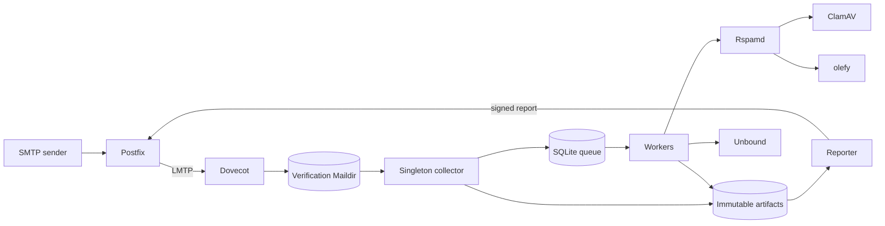

# Mailproof

[](https://github.com/LuganoPlanB/mailproof/actions/workflows/quality.yml)
[](https://github.com/LuganoPlanB/mailproof/releases/latest)

Mailproof accepts email sent for verification, preserves the exact delivered
message, analyzes it inside a constrained service graph, and produces signed,
auditable evidence reports. It is a Go service deployed with hardened Docker
Compose infrastructure: Postfix and Dovecot handle delivery, a singleton
collector seals artifacts, workers coordinate through SQLite, and Rspamd,
ClamAV, olefy, Redis, and Unbound provide isolated analysis services.

Mailproof is designed to answer _what evidence was observed for these exact
bytes?_ It does not silently turn missing scanner data into a clean result and
does not treat message-supplied authentication headers as trusted local facts.

## Evidence model

- The Maildir file produced after Postfix/Dovecot delivery is sealed before any
  analyzer runs. Analysis appends immutable results; it never modifies the
  delivered original.
- Locally observed SMTP transaction facts are stored separately from untrusted
  message headers and bound to the delivery artifact.
- One top-level `message/rfc822` attachment selects a detached verification
  subject. No such attachment selects the delivered original. Multiple
  top-level attachments produce an indeterminate selection.
- Delivery IDs, message digests, selection IDs, and analysis run IDs remain
  distinct, so duplicate message bytes do not erase delivery history.
- Missing analyzers, invalid signatures, and unavailable scanner databases are
  reported as unavailable or indeterminate, never as successful verification.

The accepted decisions are documented in
[the delivery boundary ADR](docs/adr/0001-delivery-and-evidence-boundary.md),
[the artifact identity ADR](docs/adr/0002-artifact-identity.md), and
[the v1 capability ADR](docs/adr/0003-v1-capabilities.md).

## Architecture



Postfix is the only service that publishes a host port. Mail delivery,
analysis, scanners, and report submission use separate Docker networks; every
network except public SMTP ingress is internal. Containers use read-only root
filesystems where their daemons permit it, drop capabilities by default, set
`no-new-privileges`, and have bounded PID, memory, and temporary-filesystem
allocations. See the [container boundary runbook](docs/runbooks/security-boundaries.md)
for the complete trust model.

## Requirements

- Linux amd64 for the published release images. Other Linux architectures can
  build from source when every pinned base image and Debian package is
  available for the target architecture.
- Docker Engine 27.0 or newer.
- Docker Compose plugin 2.30 or newer.
- An available host SMTP port; the default is `2525`.
- At least 4 GiB available to ClamAV. Current signature databases require at
  least 3 GiB, and the stack defaults its ClamAV limit to 4 GiB.

The deployment is deliberately single-host: SQLite and Docker named volumes
are not a multi-host queue or object store.

## Quick start on Linux amd64

Each release publishes public, reusable Linux amd64 images to GHCR and a
Compose file pinned to their immutable digests. Clone the matching tag so the
Compose file can mount its versioned configuration, then download the release
deployment file and checksum. Replace `v0.2.0` with the release you want:

```bash
MAILPROOF_RELEASE=v0.2.0
git clone --branch "${MAILPROOF_RELEASE}" --depth 1 \
  https://github.com/LuganoPlanB/mailproof.git
cd mailproof
curl --fail --location --remote-name \
  "https://github.com/LuganoPlanB/mailproof/releases/download/${MAILPROOF_RELEASE}/mailproof-${MAILPROOF_RELEASE}.compose.yaml"
curl --fail --location --remote-name \
  "https://github.com/LuganoPlanB/mailproof/releases/download/${MAILPROOF_RELEASE}/mailproof-${MAILPROOF_RELEASE}.compose.yaml.sha256"
sha256sum --check "mailproof-${MAILPROOF_RELEASE}.compose.yaml.sha256"
cp .env.example .env
printf '\nCOMPOSE_FILE=mailproof-%s.compose.yaml\n' "${MAILPROOF_RELEASE}" >>.env
```

For a local evaluation, set `MAILPROOF_CLAMAV_PROVISION=latest` in `.env`.
This downloads current signatures and is mutable, so it is not the
reproducible production path. Then initialize the report recipient, reviewing
the dry run before making changes:

```bash
scripts/init.sh --dry-run --report-recipient operator@example.org
scripts/init.sh --confirm --report-recipient operator@example.org
docker compose pull
docker compose up -d --wait
```

Verify the complete ingress path with a synthetic message:

```bash
scripts/smoke.sh --dry-run
scripts/smoke.sh --confirm
docker compose ps
```

SMTP is available on `localhost:2525` unless `MAILPROOF_SMTP_PORT` is changed.
Run `docker compose down` to stop the project while retaining its named
volumes. **Never run `docker compose down -v` against authoritative data.**

## Build from source on other architectures

The release registry currently contains Linux amd64 images only. On arm64 or
another Linux architecture, build the matching source tag locally. Compose
automatically merges `compose.override.yaml`, which contains all build
definitions, with the image-only base deployment:

```bash
MAILPROOF_RELEASE=v0.2.0
git clone --branch "${MAILPROOF_RELEASE}" --depth 1 \
  https://github.com/LuganoPlanB/mailproof.git
cd mailproof
cp .env.example .env
docker compose --profile smoke build --pull
scripts/init.sh --dry-run --report-recipient operator@example.org
scripts/init.sh --confirm --report-recipient operator@example.org
docker compose up -d --wait
```

This is a native build, not emulation. It succeeds only where the locked base
images and every version in `config/versions.env` exist for that architecture.
Do not set `COMPOSE_FILE` for this path: doing so would bypass the automatic
source-build override.

## ClamAV database provisioning

The safe default is `MAILPROOF_CLAMAV_PROVISION=none`; the full graph will not
claim scanner readiness until a valid database exists.

For reproducible operation, provision an approved HTTPS artifact with its
expected digest and release identifier:

```bash
scripts/provision-clamav-db.sh --dry-run \
  --url https://approved.example/main.cvd \
  --sha256 REPLACE_WITH_64_LOWERCASE_HEX_CHARACTERS \
  --version vendor-release

scripts/provision-clamav-db.sh --confirm \
  --url https://approved.example/main.cvd \
  --sha256 REPLACE_WITH_64_LOWERCASE_HEX_CHARACTERS \
  --version vendor-release
```

Artifact mode verifies the digest and records provenance before publishing the
database to the named volume. `latest` mode uses `freshclam`; its mutable
definitions and recorded provenance must be backed up. See the
[backup and restore runbook](docs/runbooks/backup-restore.md) for both modes.

## Operating the queue

The continuous Compose deployment runs exactly one collector. Do not launch a
second collector against the same state: lease contention intentionally exits
with status 3. For a scheduled sweep, stop the continuous collector first, or
follow the orchestration runbook.

Useful operations include:

```bash
# Bounded analysis drain
scripts/drain.sh --dry-run --max-jobs 100 --max-runtime 10m
scripts/drain.sh --confirm --max-jobs 100 --max-runtime 10m

# Read service/version status
docker compose exec -T collector mailproof status --json

# Inspect a delivery or run
docker compose exec -T collector mailproof inspect --delivery DELIVERY_ID --json
docker compose exec -T collector mailproof inspect --run RUN_ID --json

# Replay a prior run without overwriting it
docker compose exec -T collector mailproof replay --run RUN_ID --json
```

Workers may be scaled on the same host with
`docker compose up -d --scale worker=4`. Queue claims and retries use SQLite
leases; replay creates a new run and retains the previous evidence. More detail
is in the [work orchestration runbook](docs/runbooks/work-orchestration.md).

## Backup and recovery

Authoritative state includes Maildir, sealed artifacts, SQLite and its WAL,
restricted Postfix ingress logs, the submitter registry, signing keys, and
committed configuration. Backups contain sensitive correlation data and
private keys and must be encrypted at rest.

Always preview backup and restore operations:

```bash
scripts/backup.sh --dry-run --output /secure/backup
scripts/backup.sh --confirm --output /secure/backup

scripts/restore.sh --dry-run --input /secure/backup
scripts/restore.sh --confirm --input /secure/backup
```

Restore only into a fresh project. The restore command verifies its checksum
manifest before writing named volumes. Redis and Unbound are disposable caches
and are not backup inputs.

## Releases

Releases begin at [`v0.1.0`](https://github.com/LuganoPlanB/mailproof/releases/tag/v0.1.0).
Each release contains a Compose file stamped with the Mailproof version and a
portable SHA-256 checksum. It references public Linux amd64 images in GHCR by
immutable digest, so deployment never performs a local image build. The same
version is embedded in `mailproof version` and every OCI image version label.

To verify downloaded release assets:

```bash
sha256sum --check mailproof-v0.2.0.compose.yaml.sha256
```

Place the released Compose file at the root of the matching source tag: its
relative mounts intentionally use the reviewed configuration from that tag.
Set `COMPOSE_FILE` in `.env` as shown above so operator scripts and ordinary
`docker compose` commands consistently select the pull-only release file.

Successful quality runs on `main` invoke the release workflow. Conventional
`docs:` and `docs(scope):` commits do not publish software, and changes limited
to `README.md` or `docs/` stop after a lightweight change-classification job:
they run neither the code-quality suite nor the Compose smoke and do not create
a version. Commits that change both software and documentation remain eligible
for the complete quality and release pipelines.

## Development

The project targets Go 1.26.6. For software changes, the authoritative quality
workflow runs module verification, formatting, unit and race tests, vet,
staticcheck, `govulncheck`, ShellCheck, shfmt, Bats contracts, Compose validation
and builds, then a complete remote Compose smoke test.

The most useful local checks are:

```bash
go test ./...
go test -race ./...
go vet ./...
shellcheck --enable=all --shell=bash scripts/*.sh containers/*/entrypoint.sh
shfmt -d scripts containers
bats tests/shell
bash tests/mail-ingress-contract.sh
docker compose --env-file config/versions.env config --quiet
```

Read [AGENTS.md](AGENTS.md) before changing evidence semantics, artifact
identity, container boundaries, operational scripts, or release behavior.
