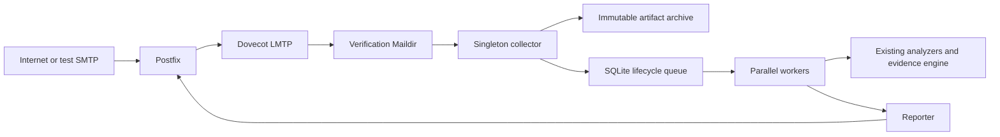

# ADR 0001: Delivery and evidence boundary

## Status

Accepted for the v1 Compose spine.

## Decision

The only production path is:

The delivered original is the exact Maildir file produced after Postfix/Dovecot
delivery and before analysis. The collector seals that file before an analyzer
runs. An analyzer may add immutable results, but never modifies the sealed
artifact. Pre-Postfix SMTP `DATA` capture is outside v1.

The locally observed SMTP transaction is a separate trusted record bound to the
delivery artifact. Message-supplied routing or authentication headers are
untrusted claims until a later, versioned trust rule accepts them.

One verification subject is selected later from the sealed original:

| Input | Subject | Authentication context |
| --- | --- | --- |
| Exactly one top-level `message/rfc822` child | Child bytes | `detached` |
| No top-level `message/rfc822` child | Delivered original | `local_ingress` |
| More than one top-level `message/rfc822` child | None; INDETERMINATE | none |

Local SPF and envelope facts authenticate the wrapper/submitter only. They are
never applied to a detached child. Inline-forwarded text is behavioral evidence
only and cannot establish VERIFIED technical authenticity. v1 creates no child
jobs for multiple attached messages.

## Consequences

Analysis is asynchronous so SMTP availability and evidence retention do not
depend on analyzer latency. Postfix/Dovecot own delivery, the collector owns
sealing and ingress binding, SQLite owns lifecycle state, workers own immutable
run analysis, and the reporter owns immutable rendered reports. A failed or
ambiguous hop retains explicit lost-coverage evidence rather than guessed facts.
